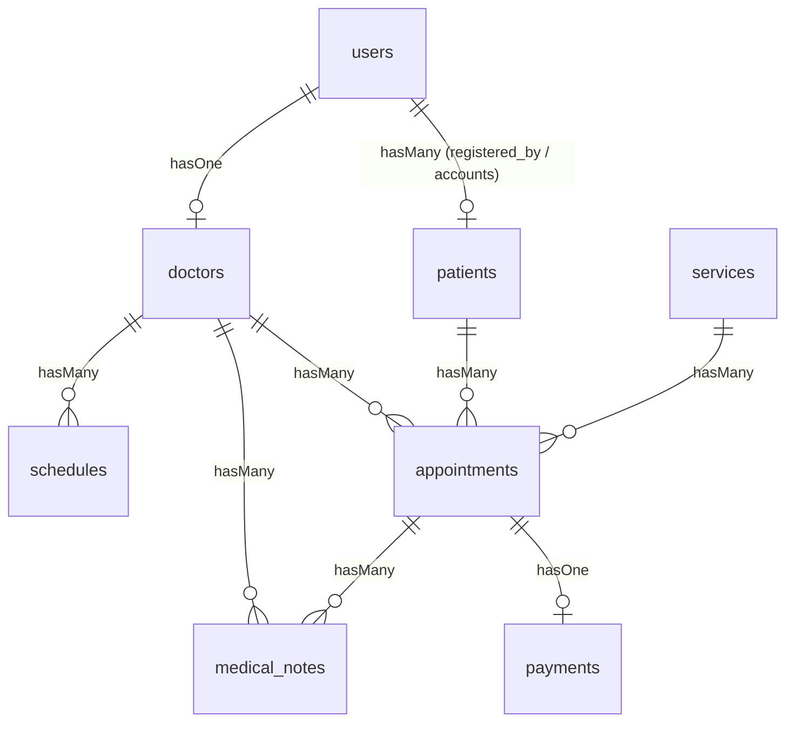

# STATUS PROJECT: KURNIA CARE (LARAVEL 12)

Dokumen ini berisi rangkuman status terkini arsitektur, fitur, dan bug sistem klinik sunat modern Kurnia Care.

---

## 1. Struktur Database & Relasi Tabel

Aplikasi ini menggunakan database relasional dengan tabel-tabel utama berikut:

### Pemetaan Tabel & Field:
1.  **`users`**
    *   `id` (Primary Key)
    *   `name` (string)
    *   `email` (string, unique)
    *   `password` (string)
    *   `role` (enum: `'admin'`, `'dokter'`, `'user'`)
    *   `phone` (string, nullable)
    *   `email_verified_at` (timestamp, nullable)
2.  **`patients`** (Menyimpan data anak & orang tua)
    *   `id` (Primary Key)
    *   `user_id` (foreignId, nullable, terhubung ke akun user jika daftar online)
    *   `registered_by_id` (foreignId, nullable, mencatat admin jika pendaftaran offline)
    *   `registration_type` (enum: `'online'`, `'offline'`)
    *   `child_name` (string), `child_age` (integer), `child_weight` (decimal)
    *   `drug_allergy`, `bleeding_history`, `surgery_history`, `disease_history` (text, nullable)
    *   `province_code`, `province_name`, `city_code`, `city_name`, `district_code`, `district_name`, `village_code`, `village_name` (string)
    *   `address` (text)
    *   `father_name`, `mother_name` (string)
    *   `phone` (string), `instagram`, `facebook` (string, nullable)
    *   `information_source` (enum: `'Instagram'`, `'Facebook'`, `'Google'`, `'Lainnya'`, nullable)
    *   `child_photo` (string, nullable)
3.  **`doctors`**
    *   `id` (Primary Key)
    *   `user_id` (foreignId, cascade)
    *   `name` (string)
    *   `specialist` (string, nullable)
    *   `sip_number` (string, nullable)
    *   `phone` (string, nullable)
    *   `photo` (string, nullable)
    *   `bio` (text, nullable)
    *   `is_active` (boolean, default: true)
4.  **`schedules`** (Jadwal mingguan dokter)
    *   `id` (Primary Key)
    *   `doctor_id` (foreignId, cascade)
    *   `day` (string)
    *   `start_time`, `end_time` (time)
    *   `quota_per_day` (integer, default: 10)
    *   `is_active` (boolean, default: true)
5.  **`appointments`** (Transaksi janji temu)
    *   `id` (Primary Key)
    *   `patient_id` (foreignId)
    *   `doctor_id` (foreignId)
    *   `service_id` (foreignId)
    *   `schedule_id` (foreignId, nullable)
    *   `appointment_date` (date)
    *   `appointment_day` (string)
    *   `appointment_time` (time)
    *   `medicine_type` (enum: `'puyer'`, `'tablet'`, `'syrup'`)
    *   `circumcision_package` (string, default: `'Paket Standar'`)
    *   `status` (enum: `'menunggu'`, `'dikonfirmasi'`, `'selesai'`, `'dibatalkan'`)
    *   `admin_note` (text, nullable)
6.  **`payments`**
    *   `id` (Primary Key)
    *   `appointment_id` (foreignId)
    *   `amount` (decimal)
    *   `payment_method` (string)
    *   `proof_image` (string, nullable)
    *   `status` (enum: `'pending'`, `'diterima'`, `'ditolak'`)
    *   `verified_by` (foreignId, nullable, references `users.id`)
    *   `verified_at` (timestamp, nullable)
    *   `rejection_reason` (text, nullable)
7.  **`medical_notes`** (Catatan medis pasca-tindakan)
    *   `id` (Primary Key)
    *   `appointment_id` (foreignId)
    *   `doctor_id` (foreignId)
    *   `note` (text)
    *   `action_status` (enum: `'berhasil'`, `'perlu_kontrol'`, `'gagal'`, `'lainnya'`)
8.  **`services`** (Paket layanan sunat)
    *   `id` (Primary Key)
    *   `name` (string), `description` (text, nullable), `price` (decimal), `is_active` (boolean)

---

## 2. Pemetaan Semua Route

| Method | URI | Route Name | Action / Controller |
| :--- | :--- | :--- | :--- |
| **GET** | `/` | - | Closure (welcome view) |
| **GET** | `/regions/provinces` | `regions.provinces` | `RegionController@provinces` |
| **GET** | `/regions/cities/{provinceCode}` | `regions.cities` | `RegionController@cities` |
| **GET** | `/regions/districts/{cityCode}` | `regions.districts` | `RegionController@districts` |
| **GET** | `/regions/villages/{districtCode}` | `regions.villages` | `RegionController@villages` |
| **GET** | `/dashboard` | `dashboard` | Redirect berdasarkan role (`web.php`) |
| **GET** | `/profile` | `profile.edit` | `ProfileController@edit` |
| **PATCH** | `/profile` | `profile.update` | `ProfileController@update` |
| **DELETE** | `/profile` | `profile.destroy` | `ProfileController@destroy` |
| **Admin Route Group (role:admin)** | | | |
| **GET** | `/admin/dashboard` | `admin.dashboard` | `Admin\DashboardController@index` |
| **GET** | `/admin/patients/check-quota` | `admin.patients.checkQuota` | `Admin\PatientController@checkQuota` |
| **RESOURCE**| `/admin/patients` | `admin.patients.*` | `Admin\PatientController` (CRUD) |
| **RESOURCE**| `/admin/doctors` | `admin.doctors.*` | `Admin\DoctorController` (CRUD) |
| **GET** | `/admin/schedules` | `admin.schedules.index` | `Admin\ScheduleController@index` (Queue Harian) |
| **GET** | `/admin/schedules/{appointment}` | `admin.schedules.show` | `Admin\ScheduleController@show` |
| **PATCH** | `/admin/schedules/{appointment}/status`| `admin.schedules.updateStatus` | `Admin\ScheduleController@updateStatus` |
| **GET** | `/admin/reports` | `admin.reports.index` | `Admin\ReportController@index` |
| **GET** | `/admin/reports/print` | `admin.reports.print` | `Admin\ReportController@print` |
| **GET** | `/admin/payments` | `admin.payments.index` | `Admin\PaymentController@index` |
| **GET** | `/admin/payments/{payment}` | `admin.payments.show` | `Admin\PaymentController@show` |
| **POST** | `/admin/payments/{payment}/verify` | `admin.payments.verify` | `Admin\PaymentController@verify` |
| **POST** | `/admin/payments/{payment}/reject` | `admin.payments.reject` | `Admin\PaymentController@reject` |
| **RESOURCE**| `/admin/services` | `admin.services.*` | `Admin\ServiceController` (CRUD) |
| **Doctor Route Group (role:dokter)** | | | |
| **GET** | `/doctor/dashboard` | `doctor.dashboard` | `Doctor\DashboardController@index` |
| **GET** | `/doctor/appointments` | `doctor.appointments.index` | `Doctor\AppointmentController@index` |
| **GET** | `/doctor/appointments/{appointment}` | `doctor.appointments.show` | `Doctor\AppointmentController@show` |
| **POST** | `/doctor/appointments/{appointment}/medical-notes`| `doctor.medical-notes.store` | `Doctor\MedicalNoteController@store` |
| **GET** | `/doctor/history` | `doctor.appointments.history` | `Doctor\AppointmentController@history` |
| **GET** | `/doctor/medical-notes` | `doctor.medical-notes.index` | `Doctor\AppointmentController@medicalNotes` |
| **Patient Route Group (role:user)** | | | |
| **GET** | `/user/dashboard` | `user.dashboard` | `User\DashboardController@index` |
| **GET** | `/user/appointments` | `user.appointments.index` | `User\AppointmentController@index` |
| **GET** | `/user/appointments/create` | `user.appointments.create`| `User\AppointmentController@create` |
| **POST** | `/user/appointments` | `user.appointments.store` | `User\AppointmentController@store` |
| **GET** | `/user/appointments/{appointment}` | `user.appointments.show` | `User\AppointmentController@show` |
| **GET** | `/user/check-quota` | `user.checkQuota` | `User\AppointmentController@checkQuota` |
| **GET** | `/user/appointments/{appointment}/payment`| `user.payments.edit` | `User\PaymentController@edit` |
| **POST** | `/user/appointments/{appointment}/payment`| `user.payments.update` | `User\PaymentController@update` |

---

## 3. Semua Controller & Fungsinya

### A. Admin Controllers
*   **`DashboardController`**:
    *   `index()`: Menampilkan summary statistik (total pasien, antrean menunggu, dikonfirmasi, selesai, Dibatalkan, nominal pembayaran Diterima) serta list janji temu & pembayaran terbaru.
*   **`DoctorController`**:
    *   `index()`: Menampilkan daftar dokter aktif & tidak aktif serta form pencarian.
    *   `create()` & `store()`: Membuat data login dokter (role: `dokter`) serta profil dokternya.
    *   `show()` & `edit()` & `update()`: Melihat detail, mengubah SIP/kontak/foto/spesialisasi dokter, serta memperbarui email & password dokter.
    *   `destroy()`: Menghapus data dokter dan akun user-nya (jika tidak ada riwayat tindakan/appointment).
*   **`PatientController`**:
    *   `index()`: Menampilkan semua data pasien (online & offline).
    *   `create()` & `store()`: Mendaftarkan pasien secara offline oleh admin (`user_id = null`, `registration_type = offline`), otomatis menunjuk dokter aktif pertama, membuat janji temu, dan tagihan pending.
    *   `show()`, `edit()`, `update()`, `destroy()`: Operasi data pasien.
    *   `checkQuota()`: Cek ketersediaan kuota harian via JSON.
*   **`PaymentController`**:
    *   `index()` & `show()`: Monitoring transaksi pembayaran transfer bank oleh pasien.
    *   `verify()`: Verifikasi pembayaran pending (mengubah status pembayaran menjadi `Diterima` dan status janji temu menjadi `dikonfirmasi`).
    *   `reject()`: Menolak pembayaran pending disertai input alasan penolakan (mengubah status pembayaran menjadi `ditolak` dan janji temu menjadi `Dibatalkan`).
*   **`ReportController`**:
    *   `index()`: Summary pendapatan klinik, rekap per jenis layanan, laporan status antrean per hari, per bulan, atau range kustom.
    *   `print()`: Halaman khusus cetak laporan berformat clean print.
*   **`ScheduleController`**:
    *   `index()` & `show()`: Manajemen antrean pasien harian klinik sunat.
    *   `updateStatus()`: Mengubah status pendaftaran pasien (`menunggu`, `dikonfirmasi`, `selesai`, `Dibatalkan`).
*   **`ServiceController`**:
    *   `index()`, `create()`, `store()`, `edit()`, `update()`, `destroy()`: Pengelolaan paket layanan sunat (harga, nama, deksripsi, status keaktifan).

### B. Doctor Controllers
*   **`DashboardController`**:
    *   `index()`: Statistik tugas dokter yang bersangkutan (antrean dikonfirmasi, selesai hari ini).
*   **`AppointmentController`**:
    *   `index()`: Menampilkan daftar pasien aktif dokter bersangkutan yang siap ditangani (`status = dikonfirmasi`).
    *   `show()`: Melihat profil detail pasien, riwayat alergi, dan catatan medis sebelumnya.
    *   `history()`: Menampilkan riwayat pasien yang sukses ditangani dokter bersangkutan.
    *   `medicalNotes()`: Rekapitulasi seluruh catatan medis yang pernah diinput dokter.
*   **`MedicalNoteController`**:
    *   `store()`: Menyimpan diagnosa/catatan tindakan dokter dan hasil status tindakan (`berhasil`, `perlu_kontrol`, `gagal`, `lainnya`). Jika status `berhasil`, janji temu otomatis selesai (`status = selesai`).

### C. Pasien (User) Controllers
*   **`DashboardController`**:
    *   `index()`: Menampilkan informasi pendaftaran aktif pasien, riwayat, dan tagihan pending.
*   **`AppointmentController`**:
    *   `index()` & `show()`: Melihat detail & riwayat pendaftaran milik akun bersangkutan.
    *   `create()` & `store()`: Formulir pendaftaran sunat online dengan data lengkap anak/orang tua, foto, wilayah terintegrasi Laravolt, otomatis menunjuk dokter aktif pertama, membuat janji temu, dan tagihan pending.
    *   `checkQuota()`: Pengecekan kuota harian sisa (maksimal 10 pendaftar per tanggal).
*   **`PaymentController`**:
    *   `edit()` & `update()`: Form upload bukti transfer bank oleh pasien ke sistem.

---

## 4. Semua Model & Relasinya

1.  **`User`**
    *   `patient()` -> `HasOne` ke `Patient` (Relasi legacy)
    *   `patients()` -> `HasMany` ke `Patient` (Relasi baru: satu akun pendaftar bisa mendaftarkan banyak pasien/anak)
    *   `doctor()` -> `HasOne` ke `Doctor`
    *   `verifiedPayments()` -> `HasMany` ke `Payment` (Sebagai admin verifikator)
2.  **`Patient`**
    *   `user()` -> `BelongsTo` ke `User` (Akun pemilik pendaftaran online)
    *   `registeredBy()` -> `BelongsTo` ke `User` (Admin pendaftar offline)
    *   `appointments()` -> `HasMany` ke `Appointment`
3.  **`Doctor`**
    *   `user()` -> `BelongsTo` ke `User`
    *   `schedules()` -> `HasMany` ke `Schedule`
    *   `appointments()` -> `HasMany` ke `Appointment`
    *   `medicalNotes()` -> `HasMany` ke `MedicalNote`
4.  **`Appointment`**
    *   `patient()` -> `BelongsTo` ke `Patient`
    *   `doctor()` -> `BelongsTo` ke `Doctor`
    *   `service()` -> `BelongsTo` ke `Service`
    *   `schedule()` -> `BelongsTo` ke `Schedule`
    *   `payment()` -> `HasOne` ke `Payment`
    *   `medicalNotes()` -> `HasMany` ke `MedicalNote`
5.  **`Payment`**
    *   `appointment()` -> `BelongsTo` ke `Appointment`
    *   `verifier()` -> `BelongsTo` ke `User` (Admin yang memproses)
6.  **`Schedule`**
    *   `doctor()` -> `BelongsTo` ke `Doctor`
7.  **`MedicalNote`**
    *   `appointment()` -> `BelongsTo` ke `Appointment`
    *   `doctor()` -> `BelongsTo` ke `Doctor`

---

## 5. Semua Middleware Yang Digunakan

1.  **`auth`** (Default Laravel): Memastikan user sudah login.
2.  **`guest`** (Default Laravel): Memastikan user belum login (untuk halaman registrasi/login).
3.  **`verified`** (Default Laravel): Memastikan email user sudah terverifikasi.
4.  **`role:[admin/dokter/user]`** ([RoleMiddleware](file:///c:/Users/aldi/kurnia-care/app/Http/Middleware/RoleMiddleware.php)): Middleware kustom yang memeriksa kecocokan string role akun login dengan parameter rute. Jika tidak cocok, melempar response **403 Forbidden**.

---

## 6. Semua Role Yang Tersedia

1.  **`admin`**: Akun administrasi klinik. Mengurusi penjadwalan antrean pasien harian, master data dokter/layanan, verifikasi pembayaran, pendaftaran offline, dan laporan omzet/cetak.
2.  **`dokter`**: Akun tenaga medis. Melayani pasien, menginput rekam medis/catatan tindakan, dan melihat riwayat kesehatan anak.
3.  **`user`**: Akun orang tua / pasien umum. Melakukan booking online, mengunggah bukti pembayaran, serta memantau status anak dari dashboard.

---

## 7. Fitur Yang Sudah Selesai (Completed)

*   [x] Landing page statis Kurnia Care.
*   [x] Register & Login multi-role (Admin, Dokter, Pasien).
*   [x] CRUD Data Dokter (oleh Admin).
*   [x] CRUD Paket Layanan Sunat (oleh Admin).
*   [x] Pendaftaran Sunat Offline (oleh Admin).
*   [x] Pendaftaran Sunat Online (oleh Pasien) terintegrasi dropdown wilayah Laravolt Indonesia secara AJAX.
*   [x] Konfirmasi & Upload Bukti Pembayaran (oleh Pasien).
*   [x] Approval / Reject Bukti Bayar disertai Alasan PemDibatalkanan (oleh Admin).
*   [x] Monitoring Antrean Harian Pasien per tanggal (oleh Admin).
*   [x] Manajemen Status Pasien: Menunggu -> dikonfirmasi -> Selesai / Dibatalkan (oleh Admin).
*   [x] Rekapitulasi Rekam Medis / Catatan Tindakan (oleh Dokter).
*   [x] Pelaporan Keuangan / Laporan Omzet Harian/Bulanan serta Fitur Cetak (oleh Admin).

---

## 8. Fitur Yang Belum Selesai (Incomplete)

*   [ ] **CRUD Jadwal Mingguan Praktik Dokter:** Halaman form (`create.blade.php`, `edit.blade.php`, `form.blade.php` di views/admin/schedules) belum terhubung ke route mana pun. Controller untuk CRUD jadwal mingguan ini belum dibuat.
*   [ ] **Pemilihan Jam/Slot Dokter di Form Booking:** Formulir pendaftaran online di user masih menggunakan input teks manual untuk jam/tanggal tanpa relasi ke slot waktu real milik tabel `schedules`.

---

## 9. Temuan Bug & Warning Kritis

1.  **Bug Driver SQLite pada Unit Testing:**
    *   *Sebab:* File migrasi `update_action_status_enum_on_medical_notes_table` memakai query MySQL mentah (`ALTER TABLE ... MODIFY`).
    *   *Dampak:* Unit testing in-memory (SQLite) gagal secara keseluruhan karena SQLite tidak mendukung sintaks alter table mysql tersebut.
2.  **Bug Redirect intended (Session cross-role 403):**
    *   *Sebab:* `AuthenticatedSessionController` menggunakan `redirect()->intended()`. Jika akun Pasien mengakses link admin sebelum login, setelah login ia dipaksa masuk ke rute admin yang memicu error **403 Forbidden** secara berulang.
3.  **Kebocoran Data (Data Isolation) pada Dokter:**
    *   *Sebab:* `Doctor\AppointmentController` memanggil seluruh data janji temu tanpa memfilternya dengan ID dokter yang sedang login (`auth()->user()->doctor->id`).
    *   *Dampak:* Jika ada 2 dokter terdaftar di klinik, Dokter A bisa mengintip dan merusak data riwayat tindakan milik Dokter B.
4.  **Ketidaksesuaian Model & Skema `schedules`:**
    *   *Sebab:* Model `Schedule.php` menggunakan fillable `'day'`, sedangkan migrasi database awal mendefinisikan `'schedule_date'`.

---

## 10. Daftar File Penting Yang Perlu Diperhatikan

*   **Rute Utama:** [routes/web.php](file:///c:/Users/aldi/kurnia-care/routes/web.php)
*   **Logika Autentikasi:** [app/Http/Controllers/Auth/AuthenticatedSessionController.php](file:///c:/Users/aldi/kurnia-care/app/Http/Controllers/Auth/AuthenticatedSessionController.php)
*   **Form Pendaftaran Online:** [resources/views/user/appointments/create.blade.php](file:///c:/Users/aldi/kurnia-care/resources/views/user/appointments/create.blade.php)
*   **Middleware Proteksi Role:** [app/Http/Middleware/RoleMiddleware.php](file:///c:/Users/aldi/kurnia-care/app/Http/Middleware/RoleMiddleware.php)
*   **Skenario Pengujian Unit:** [tests/Feature/Auth/AuthenticationTest.php](file:///c:/Users/aldi/kurnia-care/tests/Feature/Auth/AuthenticationTest.php)
*   **Penyebab Error Migrasi:** [database/migrations/2026_05_23_183425_update_action_status_enum_on_medical_notes_table.php](file:///c:/Users/aldi/kurnia-care/database/migrations/2026_05_23_183425_update_action_status_enum_on_medical_notes_table.php)
